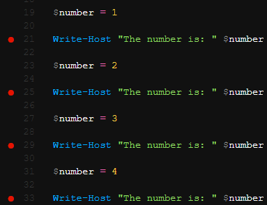
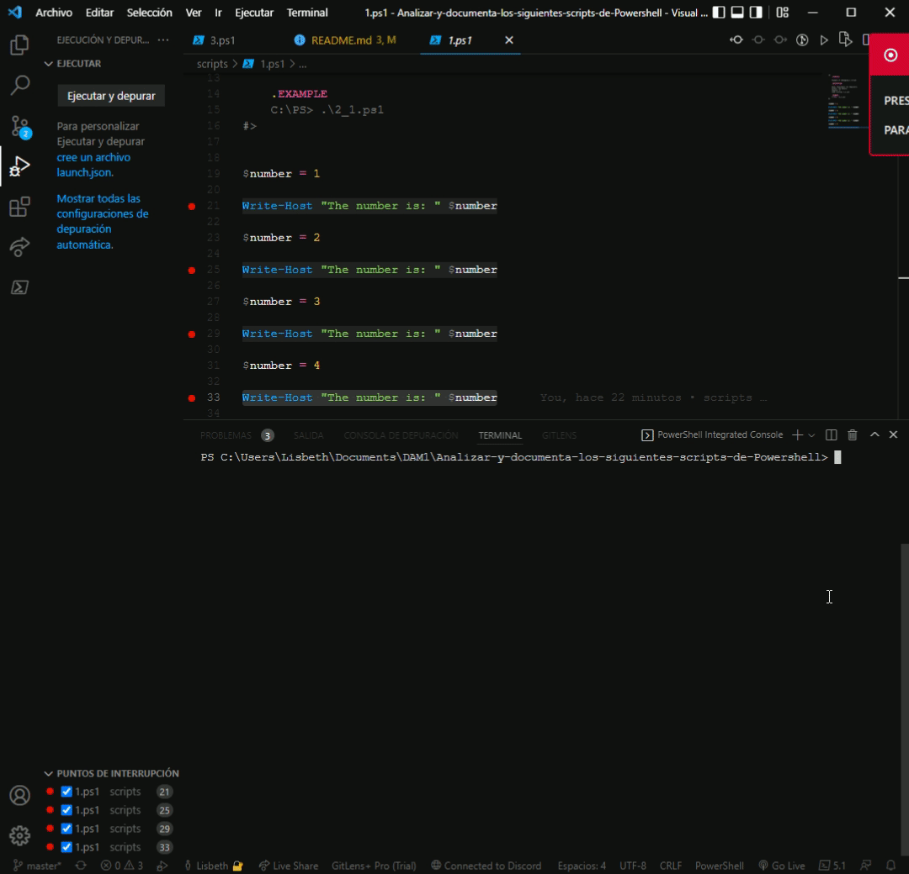
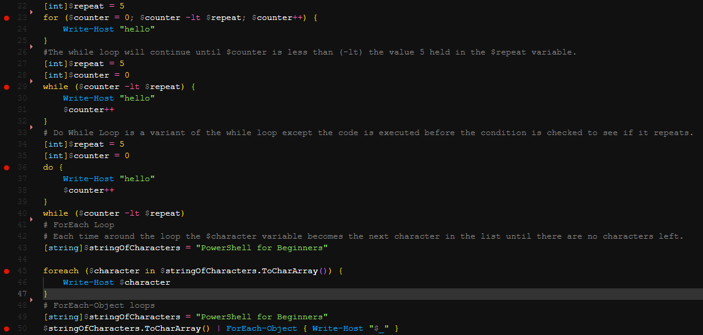

# ***Analizar y documenta los siguientes scripts de Powershell***

Practica Powershell. Sistemas informáticos  

## **Script 1**

Para comprender el funcionamiento del siguiente script vamos a añadir varios puntos de interupcion como se muestra a continuación: 

*(Los puntos rojos son los puntos de interrupción.)*

Conforme vayamos ejecutando el script, a una variable `$number` se le asigna el valor 1; luego se escribe en la pantalla mediante el cmdlet `Write-Host`. Luego, a la variable `$number` se le asigna el siguiente número en la secuencia y se muestra en la pantalla nuevamente, y esto se repite varias veces. 

A continuación se muesttra la ejecución del script:

---

## **Script 2**

Añadimos los siguientes puntos de interrupción para ver el funcionamiento del siguiente script:

Y observamos la ejecucion del script: 

---

